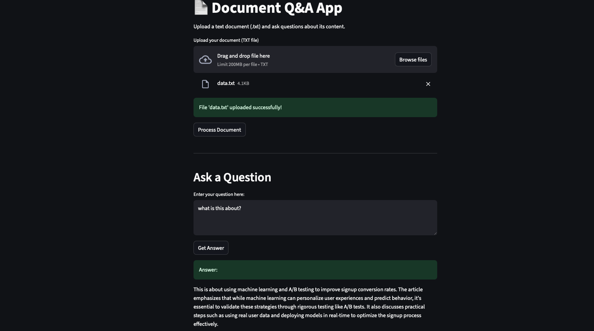

# 📄 Document Q&A with RAG

A Streamlit web application that allows users to upload a text document and ask questions about its content using Retrieval-Augmented Generation (RAG) with LangChain and OpenAI.


---

## 🚀 Project Description

This project is an interactive web app that leverages the power of Large Language Models (LLMs) and vector search to answer questions about the content of any uploaded text document. It uses the RAG (Retrieval-Augmented Generation) approach, combining document retrieval with generative AI to provide accurate, context-aware answers.

---

## 🧩 Main Topics & Technologies

- **Streamlit**: For building the interactive web UI.
- **LangChain**: For chaining together document loaders, text splitters, embeddings, and LLMs.
- **OpenAI API**: For generating answers using a GPT model.
- **Chroma**: As the vector database for efficient document retrieval.
- **RAG (Retrieval-Augmented Generation)**: Combines retrieval of relevant document chunks with generative AI.
- **python-dotenv**: For managing API keys securely.

---
## 🛠️ Setup Instructions

1. **Clone the repository**
   ```bash
   git clone <https://github.com/wassupjay/Doc-QnA-with-RAG>
   cd Doc-QnA
   ```

2. **Install dependencies**
   ```bash
   pip install -r requirements.txt
   ```

3. **Set your OpenAI API key**
   - Create a `.env` file in the project directory:
     ```env
     OPENAI_API_KEY=your_openai_api_key_here
     ```

4. **Run the app**
   ```bash
   streamlit run app.py
   ```

---

## 📝 How It Works (Step-by-Step)

1. **Upload Document**
   - Upload a `.txt` file using the file uploader in the app.

2. **Process Document**
   - Click the "Process Document" button.
   - The app:
     - Loads the document.
     - Splits it into manageable chunks.
     - Converts each chunk into vector embeddings using OpenAI.
     - Stores the embeddings in a Chroma vector database.
     - Sets up a RetrievalQA chain with a GPT model for answering questions.

3. **Ask Questions**
   - Enter your question in the text area.
   - Click "Get Answer".
   - The app:
     - Retrieves the most relevant document chunks using vector similarity.
     - Passes them, along with your question, to the LLM.
     - Displays the generated answer.

---

## 🧠 RAG Workflow Explained

- **Retrieval**: Finds the most relevant parts of your document using vector search.
- **Augmented Generation**: The LLM uses both your question and the retrieved context to generate a precise answer.

---

## 📂 File Structure

- `app.py` — Main Streamlit app.
- `requirements.txt` — Python dependencies.
- `data.txt`, `temp_doc_data.txt` — Example data files.

---
## Sample Output

## 🙏 Credits

- Built with [Streamlit](https://streamlit.io/), [LangChain](https://langchain.com/), [Chroma](https://www.trychroma.com/), and [OpenAI](https://openai.com/).

---

## 📝 License

MIT License 